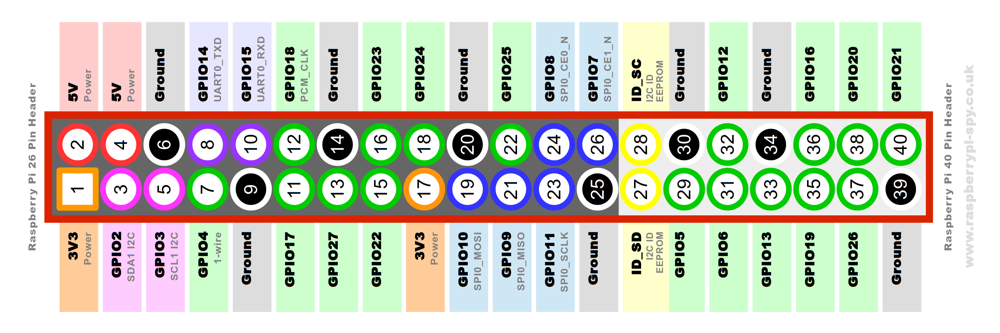
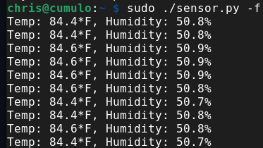

# Raspberry Pi Temperature Sensors

It's HOT!

I suppose one can't complain too much about living in Paradise, but when my wife and I moved to Hawaii last fall, I didn't really think too much about the weather.
Don't get me wrong, the weather is lovely pretty much all the time, and we keep our windows open 24/7, but that means it is pretty warm in the house right now in the middle of summer.

So where does all this humble bragging intersect with Open Source?
Well, we're planning to get a whole-house fan - one of those big ones that suck all the air out of your house and force it into the attic, pushing all the hot air out of the attic in the process.
I am _sure_ this will make the house way cooler, but the geek in me wants to know just how much cooler.

So today, I'm playing with temperature sensors, [Raspberry Pis](https://www.raspberrypi.org/), and [Python](https://www.python.org/).

Play along at home! Nothing like a little #CitizenScience!

|  |
|:--:|
| *Charming little development environment, isn't it?* |

Yes, ok, I could just buy a thermometer or two, check them each day, and see what happens, but why do that when you can totally over-engineer a solution, automate the data collection and graph it all over time, amirite?

Here's what we need:

* Raspberry Pi Zero W (or, really, any Raspberry Pi)
* DHT22 digital sensor
* SD Card

## Connect the DHT22 Temperature and Humidity Sensor to the Raspberry Pi Zero W

You can find a bunch of inexpensive DHT22 temperature and humidity sensors with a quick web search. The DHT22 is a digital sensor, making it easy to interact with.
If you purchase a raw sensor, you'll need a resistor and some soldering skills to get it working (check out this [PiMyLifeUp DHT22 article](https://pimylifeup.com/raspberry-pi-humidity-sensor-dht22/) for great instructions on working with the raw sensor), but you can also purchase them with a small PCB that includes all that, which is what I did.

With the attached PCB, the DHT22 now has three pins, a Positive (marked with +) pin, a Data pin, and a Ground (marked with -) pin.
The DHT22 can be wired directly to the Raspberry Pi Zero W.
I used [www.raspberrypi-spy.co.uk's Raspberry Pi GPIO Guide](https://www.raspberrypi-spy.co.uk/2012/06/simple-guide-to-the-rpi-gpio-header-and-pins/) to make sure I was connecting everything up correctly.

The Positive pin provides power from the Pi to the DHT22.
The DHT22 runs on 3v-6v, so I selected one of the 5v pins on the Raspberry Pi to provide the power.
The Data pin on the DHT22 needs to be connected to one of the Raspberry Pi GPIO pins.
I am using GPIO4 for this, but any would work.
Just make a note, as the Python code used to read the data from the sensor will need to know which pin to read from.
Finally, the Ground pin on the DHT22 must be connected to a ground pin on the Raspberry Pi header.

This is how I wired it up:

* DHT22 Positive pin <-> Raspberry Pi GPIO v5 pin (#2)
* DHT22 Data pin <-> Raspberry Pi GPIO4 pin (#7)
* DHT22 Ground pin <-> Raspberry Pi Group pin (#6)

You can see the pin layout for the Raspberry Pi Zero W (among others) in the diagram below.

||
|:-:|
| Raspberry Pi GPIO Header Diagram,Copyright © 2021 Matt Hawkins, www.raspberry-spi.co.uk |

## Install the DHT Sensor Software

I will assume you already have an operating system installed on the Raspberry Pi Zero W and are able to connect to it remotely or with a keyboard.
If not, I've written previously about [customizing different operating system images for Raspberry Pi](https://opensource.com/article/20/5/disk-image-raspberry-pi).
I am using [Raspberry Pi OS Lite](https://www.raspberrypi.org/software/operating-systems/), release May 7, 2021 as the image for the Raspberry Pi Zero W.

Once the operating system is installed on an SD Card, and the Raspberry Pi booted from the card, there are only a couple software packages to install in order to interact with the DHT22.

First, the Python Preferred Installer Program (pip) can be installed with via apt-get, and then pip can be used to install the [Adafruit DHT sensor library for Python](https://github.com/adafruit/Adafruit_Python_DHT) for interacting with the DHT22 sensor.

```shell
# Install pip3
sudo apt-get install python3-pip

# Install the Adafruit DHT sensor library
sudo pip3 install Adafruit_DHT
```

## Getting Sensor Data with Python

With the DHT libraries installed, it is now possible to connect to the sensor and retrieve temperature and humidity data.

Create a file with the following:

```txt
#!/usr/bin/env python3

import sys
import argparse
import time

# This imports the Adafruit DHT software installed via pip
import Adafruit_DHT

# Initialize the DHT22 sensor
SENSOR = Adafruit_DHT.DHT22

# GPIO4 on the Raspberry Pi
SENSOR_PIN = 4

def parse_args():
    parser = argparse.ArgumentParser()
    parser.add_argument("-f", "--fahrenheit", help="output temperature in Fahrenheit", action="store_true")

    return parser.parse_args()

def celsius_to_fahrenheit(degrees_celsius):
        return (degrees_celsius * 9/5) + 32

def main():
    args = parse_args()

    while True:
        try:
            # Gather the humidity and temperature
            # data from the sensor; GPIO Pin 4
            humidity, temperature = Adafruit_DHT.read_retry(SENSOR, SENSOR_PIN)

        except RuntimeError as e:
            # GPIO access may require sudo permissions
            # Other RuntimeError exceptions may occur, but
            # are common.  Just try again.
            print(f"RuntimeError: {e}")
            print("GPIO Access may need sudo permissions.")

            time.sleep(2.0)
            continue

        if args.fahrenheit:
            print("Temp: {0:0.1f}*F, Humidity: {1:0.1f}%".format(celsius_to_fahrenheit(temperature), humidity))
        else:
            print("Temp:{0:0.1f}*C, Humidity: {1:0.1f}%".format(temperature, humidity))

        time.sleep(2.0)

if __name__ == "__main__":
    main()
```

The important bits here are initializing the sensor and setting the correct GPIO pin to use on the Raspberry Pi:

```txt
# Initialize the DHT22 sensor
SENSOR = Adafruit_DHT.DHT22

# GPIO4 on the Raspberry Pi
SENSOR_PIN = 4
```

As well as reading the data from the sensor with the variables set above for the sensor and pin:

```txt
# This connects to the sensor "SENSOR"
# Using the Raspberry Pi GPIO Pin 4, "SENSOR_PIN"
    humidity, temperature = Adafruit_DHT.read_retry(SENSOR, SENSOR_PIN)
```

Finally, run the script! You should end up with something like this:

||
|:-:|
| _Oof! Hot and Humid in here!_ |

Success!

## Where to go from here

Now, I have three of these DHT22 sensors, and three Raspberry Pi Zero Ws connected to my Wifi.
I've installed them into some small project boxes, hot-glued the sensors to the outside, and set them up in my living room, office, and bedroom.
With this setup, I can collect sensor data from them any time I want, by SSHing into the Raspberry Pi and running this script.
But why stop there?
Manually SSHing into them each time is tedious and too much work.
We can do better!

In a future article we'll learn how to setup this script to run automatically at startup with a [Systemd service](https://www.freedesktop.org/software/systemd/man/systemd.service.html), setup a webserver to display the data, and instrument this script to export data in a format that can be read by [Prometheus](https://prometheus.io/), a monitoring system and time series database.
We use Prometheus at work to collect data about our OpenShift/Kubernetes clusters, plot trends and create alerts based on the data.
Why not go totally overboard and do the same thing with temperature and humidity data at home?
This way I can get baseline data, and then see how well the whole-house fan changes things!

\#CitizenScience!
